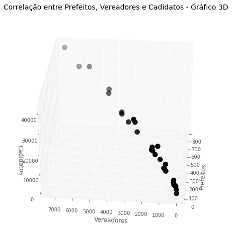

# Análise dos resultados da eleição - 2020
Este repositório contém script analítico em relação aos dados públicos sobre as eleições brasileiras

 

# _Objetivo do projeto_

O objetivo deste projeto é utilizar técnicas de ciência de dados para analisar as informações geradas nos processos eleitorais brasileiros, especificamente focando no primeiro turno das eleições municipais e estaduais de 2020. O objetivo principal é identificar padrões e tendências no comportamento eleitoral, fornecendo insights valiosos para os partidos políticos, candidatos, órgãos eleitorais, mídia e cidadãos.

 

# _1. Problema de Negócio_

O problema de negócio consiste em entender o comportamento dos partidos e da sociedade durante o processo eleitoral, buscando responder questões como: Quais são os fatores que influenciam os resultados das eleições? Quais são as preferências e características dos eleitores em relação aos candidatos e partidos? Quais são as tendências de voto ao longo do tempo? Essas informações podem auxiliar na tomada de decisões estratégicas, como definição de campanhas políticas, formulação de propostas e estratégias de comunicação.

Fonte: https://dadosabertos.tse.jus.br/dataset/

 

# _2. Justificativa_

- **Por quê:** A análise dos dados eleitorais é fundamental para entender e melhorar o sistema político. Ao explorar os dados disponíveis, é possível identificar padrões e tendências que podem fornecer insights valiosos sobre o comportamento dos eleitores, preferências políticas, fatores que influenciam nas decisões de voto, entre outros aspectos relevantes. Essas informações podem ser utilizadas para direcionar estratégias políticas, otimizar campanhas eleitorais, promover maior transparência no processo eleitoral e fortalecer a democracia.
- **Como:** Através da aplicação de técnicas de ciência de dados, como análise descritiva e analisando graficamente para identificar padrões e relações entre as variáveis.
- **O quê:** O projeto visa coletar os dados eleitorais do primeiro turno das eleições municipais e estaduais de 2020, incluindo informações sobre eleitorado, candidatos, resultados das eleições, entre outros. Em seguida, serão realizadas análises exploratórias dos dados, buscando identificar padrões, tendências e correlações relevantes.

 

# _3. Premissas_

As variáveis originais do conjuto de dados são: 

Variável | Definição
------------ | -------------
uf | sigla do estado onde está localizado o município|
type_id | código do tipo de eleição (11 para eleição majoritária e 13 para eleição proporcional)
codigo_tse | código do município definido pelo Tribunal Superior Eleitoral (TSE)
nome_municipio | nome do município onde ocorreu a eleição
capital | valor binário indicando se o município é capital (1 para capital e 0 para não capital)
codigo_ibge | código do município definido pelo Instituto Brasileiro de Geografia e Estatística (IBGE)
job_count | número total de candidatos a cargos eletivos no município
elector_count | número total de eleitores aptos a votar no município
elector_presence | valor binário indicando se houve presença de eleitores (s para sim e n para não)
absentees | número de eleitores que não compareceram às urnas
nominal_votes | número de votos nominais, ou seja, os votos dados diretamente aos candidatos
blank_votes | número de votos em branco
total_null_votes | número total de votos nulos
null_votes | número de votos nulos por candidato
technical_null_votes | número de votos nulos por problemas técnicos (como erro de preenchimento da urna eletrônica)
valid_votes | número total de votos válidos (nominais + brancos)
nulled_votes | número total de votos nulos
judically_nulled_votes | número de votos nulos por decisão judicial
vote_count | número total de votos registrados na seção eleitoral
candidate_number | número de identificação do candidato
candidate_name | nome do candidato
candidate_coligation | nome da coligação partidária a que o candidato pertence
candidate_vice_name | nome do candidato a vice-prefeito, se houver
candidate_vote_destination | cargo para o qual o candidato concorreu (prefeito ou vereador)
candidate_vote_count | número de votos recebidos pelo candidato
legend_votes | número de votos recebidos pela legenda partidária
job | cargo para o qual o candidato concorreu (prefeito ou vereador)
main_party | nome do partido político ao qual o candidato é filiado

 

# _4. Planejamento da Solução_

0. **ENTENDIMENTO DO NEGÓCIO**

Definição do problema: É importante definir claramente qual é o problema a ser resolvido ou a pergunta a ser respondida. É preciso entender o objetivo do projeto e a relevância do problema.

    - Descrição do negócio
    - Planejamento da solução

1. **IMPORTANDO AS BIBLIOTECAS**

Importação de bibliotecas: Nesta etapa, as bibliotecas necessárias para o desenvolvimento do modelo de machine learning são importadas. Isso inclui bibliotecas para manipulação de dados, visualização, modelagem e avaliação.

2. **COLETA DOS DADOS**

Coleta de dados: Nesta etapa, os dados são coletados a partir de diversas fontes, como bases de dados, APIs, arquivos de texto, imagens, etc.

3. **FUNÇÕES AUXILIARES**

Funções auxiliares: Nesta etapa, são criadas funções que serão utilizadas ao longo do projeto para realizar tarefas específicas, como limpeza de dados, visualização de gráficos, pré-processamento, entre outros.

4. **ANÁLISE EXPLORATÓRIA DOS DADOS**

Análise exploratória de dados: Nesta etapa, os dados são analisados para identificar possíveis padrões, tendências, correlações e informações relevantes que possam auxiliar na construção do modelo de machine learning. É importante entender os dados coletados, avaliar a qualidade dos dados e identificar quaisquer problemas ou limitações.

    - **Passo 1:** Análise Descritiva dos Dados
        - Esta etapa consiste na descrição estatística dos dados coletados, como média, mediana, desvio padrão, entre outros.
    - **Passo 2:** Exploração de Dados
        - Nesta etapa, os dados são visualizados e analisados graficamente para identificar padrões e relações entre as variáveis.

5. **INSIGHTS**

Nesta etapa, são identificadas as principais descobertas e conclusões do projeto.

 

# _5. Insights_

*Resumo dos insights durante análise exploratória de dados (EDA):*

**1º Gráfico:**

 

**Nota:**
- Podemos observar que MDB,PP,PSD,PSDB e DEM concentram a grande maioria dos prefeitos eleitos com 57%.
- O MDB é um partido forte na representação dentro do país na quantidade de prefeitos.

**2º Gráfico:**

 

**3º Gráfico:**

 

**Nota:**
- Podemos observar que MDB,PP,PSD,PSDB e DEM também concentram a grande maioria dos prefeitos como os vereadores eleitos com 48%.
- O MDB é um partido forte na representação dentro do país na quantidade de prefeitos e vereadores.

**4º Gráfico:**

 

**Nota:**

- Podemos observar que existe uma correlação entre prefeitos e vereadores.
- Analisando a quantidade de prefeitos, ela tá tendo uma relação com a quantidade de vereadores eleitos, não temos um desbalanceamento muito grande.
- Temos alguns partidos fora do intervalo de confiança, mas a grande maioria está dentro desse intervalo, então podemos ver que existe uma relação entre essas duas variáveis, que é o quanto curioso.
- Temos um ponto que sai um pouco do comportamento é o partido do PT, onde ele tem um comportamento de eleger mais vereadores do que prefeitos comparado com o todo.
- Temos o PSDB que tem um comportamento inverso, ele elege mais prefeitos do que vereadores, fugindo um pouco do comportamento dos demais partidos.

**5º Gráfico:**

 

**Nota:**

- Observando os três eixos, podemos ver que os pontos sai do menor valor e indo na direção do maior valor, isso indica, que existe uma correlação, ou seja, quanto mais candidatos você colocar para a disputa de uma eleição, mais vereadores ou mais prefeitos, você vai estar elegendo.

 

# _6. Conclusão_

Neste projeto, realizamos uma análise abrangente dos dados públicos das eleições brasileiras, focando nos resultados do 1º turno das eleições municipais e estaduais de 2020. Utilizamos técnicas de ciência de dados, incluindo análise exploratória de dados, análise descritiva e visualização dos gráficos, com o objetivo de identificar padrões, tendências e insights relevantes sobre o comportamento dos partidos e da sociedade durante o processo eleitoral.

Durante a análise exploratória dos dados, observamos diversas informações de grande valor. Identificamos correlações entre características dos candidatos e os resultados eleitorais, revelando a importância de fatores como histórico político, popularidade e apoio partidário.

 

# _7. Próximos passos_

- Realizar análise de séries temporais, agrupamento de dados, análise de redes sociais, modelagem preditiva, mineração de dados e aplicação de técnicas de aprendizado de máquina.
